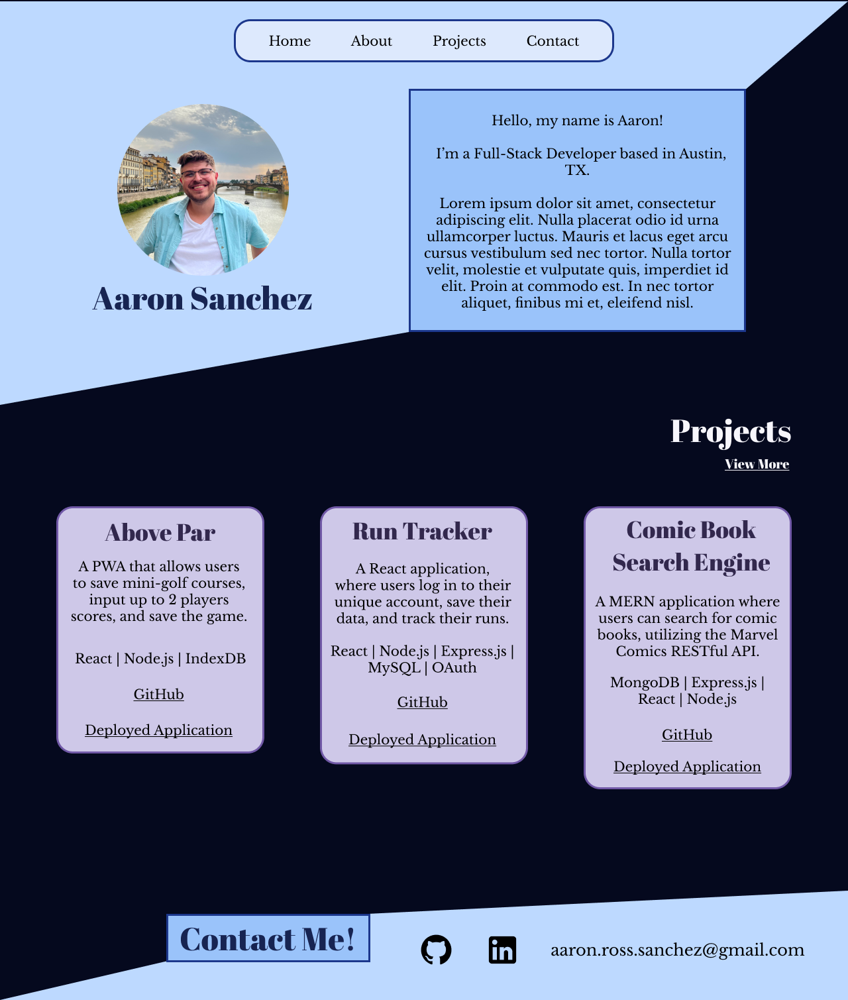
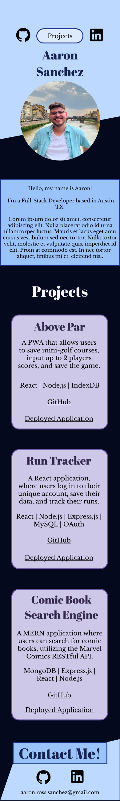

# Portfolio 

A personal portfolio using the React framework and deploying to Netlify.

## Table of Contents

- [Development](#development)
- [Screenshot](#screenshot)
- [Deployed Link](#deployed-link)
- [License](#license)
- [Credits](#credits)
- [Questions](#questions)

### Development

High Fidelity Mock-ups:

| Desktop                                   | Mobile                                    |
|-------------------------------------------|-------------------------------------------|
|            |              |

### Deployed Link

[aarosan.com](http://www.aarosan.com)

### License

MIT License

### Credits

Module 20 Class Examples 
React Documentation

### Questions

If you have any questions, you can find me at my GitHub: [aarosan](http://github.com/aarosan)